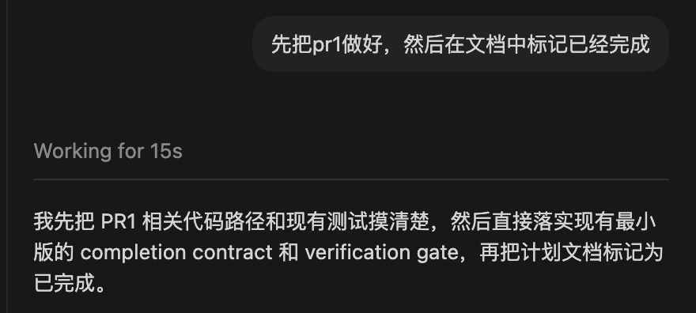

# Interaction Harness / 交互 Harness

## 一句话 / One Sentence

很多用户输入并不是完整任务，而是对当前上下文的续接。

像 `好`、`ok`、`继续`、`先做 PR1` 这样的短输入，只有放回前后文里，系统才能稳定理解它真正代表什么。

本文把这类能力抽象成 Harness 的交互入口层，用来指导 `Claude_Code_MVP` 的设计。

它是一个 harness engineering 视角下的概念模型，不是对 Claude Code 内部源码结构的源码级还原。

## 0. 文档定位 / What This Doc Is And Is Not

这篇文档讨论的是一种**设计抽象**：

- 它试图解释为什么短输入续接、启动前回显、澄清阈值这些行为值得被单独思考
- 它试图为本项目提供更稳定的术语和边界

这篇文档**不直接声称**：

- Claude Code 内部明确存在一个名为 `interaction harness` 的独立模块
- Claude Code 已被证明按 `intent normalization -> kickoff -> continuation policy` 这种命名方式分层实现

更准确地说：

- Claude Code 一类产品的实际交互现象，启发了这个抽象
- `Claude_Code_MVP` 可以把这些现象工程化成更明确的 harness 设计

本文并不是提出一套与 Claude Code 相反的思路，而是尝试用更显式的 harness 术语，整理 Claude Code 一类产品中已经隐含存在的交互控制思想。

## 1. 为什么要单独看这层 / Why This Layer Deserves Its Own Doc

在 Agent 系统里，用户并不总是给出完整、结构化、一次说清的指令。

很多真实输入都是：

- 简短确认：`好`
- 继续执行：`继续`
- 范围指定：`先做 pr1`
- 状态切换：`那先别做这个`
- 轻度修正：`文档也一起补上`

如果系统把这些输入当成独立 prompt 直接交给模型，很容易出现三个问题：

- 脱离上下文：模型不知道 `好` 到底是在确认什么
- 启动不透明：用户不知道系统接下来会做哪一步
- 行为漂移：不同模型、不同 prompt 风格下，对同一句短输入的解释可能不同

所以从 harness design 的角度看，系统通常需要在真正执行前做一层交互控制。

## 2. 这层到底在做什么 / What This Layer Actually Does

如果把这类交互入口行为抽象出来，可以把它拆成三个能力。

### 2.1 输入规范化 / Intent Normalization

把用户的自然表达转换成更稳定、可执行的内部任务表示。

例如：

- 用户输入：`好`
- Harness 风格的内部理解：继续执行上一轮已经确认的 PR1 实施任务

再例如：

- 用户输入：`先把 pr1 做好，然后在文档中标记已经完成`
- Harness 风格的内部理解：
  - 先实现 PR1 的代码与测试
  - 完成后更新开发文档状态

这里的重点不是“润色用户原话”，而是：

- 识别这是不是续轮输入
- 识别它继承的是哪一段上下文
- 补出执行所需的明确动作

### 2.2 执行启动回显 / Execution Kickoff Echo

在真正干活前，用一条简短更新告诉用户：

- 我理解的任务是什么
- 我先做哪一步

例如：

- `我先把 PR1 相关代码路径和现有测试摸清楚，然后直接落实现有最小版的 completion contract 和 verification gate，再把计划文档标记为已完成。`

这一步的本质是可观察性，而不是客套。

它的作用是：

- 让用户知道系统没有跑偏
- 让用户能及时打断错误理解
- 降低“系统是不是已经开始做别的事”的不确定感

### 2.3 续轮策略 / Turn Continuation Policy

当用户只说一句短话时，系统需要决定：

- 是继续上一轮任务
- 是切换到新任务
- 还是必须反问确认

这其实就是 turn continuation policy。

## 3. 它在整体 Harness 里属于哪一层 / Where It Sits In The Overall Harness

如果按本项目常说的三层去看，这类职责会跨过多个层面：

- 信息层：它利用已有上下文理解短输入
- 约束层：它决定哪些短输入可以默认续接，哪些必须确认
- 自动化层：它把规范化后的任务送进后续执行闭环

但如果要给它一个更清楚的名字，最合适的分类是：

**交互入口层，或交互控制面。**

作为一个设计抽象，它大致位于：

`user utterance -> intent normalization -> visible kickoff -> execution loop`

也就是说，它处在正式执行之前，但会直接影响后续整个执行链。

## 4. 为什么这不是模型能力本身 / Why This Is Not Pure Model Capability

表面上看，像“把 `好` 扩写成完整句子”很像模型自然语言能力。

但真正重要的其实不是语言改写，而是下面这些控制职责：

- 当前短输入是否应该继承上一轮上下文
- 应继承哪一段上下文
- 是否需要显式说明即将执行的步骤
- 哪些情况下不能默认继续，必须停下来确认

这些判断如果完全交给模型临场发挥，会出现几个问题：

- 不同模型解释不一致
- 同一模型在不同 prompt 下行为漂移
- 用户很难预测系统到底会不会“继续猜”

所以从工程稳定性的角度看，更稳的做法是：

- 语言表达可以交给模型
- 续轮规则、回显规则、停止条件应该由 Harness 决定

一句话说：

**这层的文案可以像模型能力，但它的行为边界应该属于 Harness。**

## 5. 这层通常包含哪些规则 / What Rules Usually Live Here

一个较成熟的交互入口控制面，通常至少要有这几类规则。

### 5.1 短输入继承规则 / Short Utterance Inheritance Rules

例如：

- `好` / `ok` / `继续`
  默认继承上一轮最近一次明确确认过的任务
- `先做 X`
  覆盖当前执行顺序，但保留主题上下文
- `别做这个了`
  终止当前任务并等待新指令

### 5.2 回显长度规则 / Kickoff Echo Length Rules

例如：

- 用户只是确认时
  只回一句短启动说明
- 用户给了复杂要求时
  可以回一段更完整的执行拆解
- 不要把用户简短输入反复润色成长段复述

### 5.3 反问阈值规则 / Clarification Threshold Rules

例如遇到这些情况时不应默认继续：

- 上下文里存在两个同样合理的下一步
- 用户输入会触发高风险行为
- 范围变更明显但不够明确
- 当前短输入无法唯一映射到上一轮任务

### 5.4 用户可见进度规则 / User-Visible Progress Rules

例如：

- 开始探索前给出启动回显
- 做 substantial work 前给出当前计划
- 编辑文件前说明将改什么

这部分和本项目的中间 `commentary` 更新习惯是对应的。

## 6. 一个完整例子 / A Complete Example

下面这段交互很典型，也适合作为这份抽象的说明例子：

- 用户：`好`
- Harness 判断：
  - 这不是新任务
  - 它是在确认上一轮建议继续推进
  - 当前最合理动作是进入下一步实施
- 用户可见回显：
  - `我先把现有代码路径和测试摸清楚，然后开始实现 PR1。`

再看另一个例子：

- 用户：`先把pr1做好，然后在文档中标记已经完成`
- Harness 判断：
  - 这是一个明确任务
  - 包含两个顺序动作
  - 不需要再问
- 用户可见回显：
  - `我先完成 PR1 的代码和测试，再更新开发文档中的状态标记。`

真正关键的是这里的“判断和续接”，而不是“说得更像人”。

### 6.1 示例截图 / Example Screenshot

下面这个截图展示了一个真实的 agent 交互界面表现：

- 用户输入本身很短，且带有上下文续接意味
- 系统在开始执行前，先把内部理解补成更完整的启动说明
- 这条启动说明的价值不在于“润色”，而在于让下一步动作变得可见、可检查

从这个例子里，可以把界面行为解释成三个动作同时发生了：

- 输入规范化：把用户的任务理解成更具体的执行意图
- 执行启动回显：在真正干活前明确说出“先做什么”
- 用户可见透明度：让用户有机会在执行早期就发现理解偏差

这里的关键词是“可以解释成”，而不是“已经证明 Claude Code 内部就按这三个模块实现”。

## 7. 对本项目有什么启发 / What This Suggests For This Project

对 `Claude_Code_MVP` 来说，这个抽象虽然还没有被单独实现成模块，但在理念上已经很重要。

后续如果要继续工程化，可以把它逐步抽成更明确的能力：

- intent normalization
- turn continuation policy
- kickoff message policy
- clarification threshold

它们不一定一开始就变成复杂代码模块，但至少应该在文档和设计里被明确承认。

否则系统会默认把“对话入口行为”当成模型自然发挥的一部分，后面就很难稳定。

### 7.1 和 Claude Code 快照的关系 / Relation To The Claude Code Snapshot

目前能较稳支持的说法是：

- Claude Code 快照里可以看到与这类能力相关的实现要素
- 这些实现要素分散在输入处理、恢复逻辑、提问工具、REPL 交互队列等模块里
- 它支持“存在相关行为控制”的判断

目前不应说得太满的是：

- Claude Code 已被证明有一个独立命名的 `interaction harness` 模块
- 文中的术语就是 Claude Code 官方内部术语
- 文中的三段式分解已经被源码直接证实

所以这篇文档更适合被理解为：

- `受 Claude Code 类产品启发的 harness 抽象`

而不是：

- `Claude Code 内部实现的精确还原`

### 7.2 Claude Code 泄漏源码观察 / What The Leaked Claude Code Snapshot Actually Shows

下面这些点，是根据 Claude Code 泄漏快照中可以直接定位到的代码路径做出的较稳总结。

#### A. 短输入继续识别 / Short Continuation Recognition

快照里可以直接看到对“继续”类输入的专门识别，而不是把所有输入都当成同一种自由文本。

- `src/utils/userPromptKeywords.ts` 中的 `matchesKeepGoingKeyword()` 会匹配 `continue`
- 同一个函数还会匹配 `keep going`、`go on`
- `src/utils/processUserInput/processTextPrompt.ts` 会调用这个识别逻辑，并记录 `is_keep_going`

这说明 Claude Code 至少显式地区分了“这句像是在要求继续当前上下文”与普通输入。

#### B. 中断后的续接恢复 / Continuation After Interruption

快照里还能看到一条更强的实现证据：如果一次 turn 在中途被打断，恢复逻辑会主动补出一个 synthetic continuation message。

- `src/utils/conversationRecovery.ts` 会检测 `interrupted_turn`
- 然后追加一条 meta user message：`Continue from where you left off.`
- 再把状态统一成 `interrupted_prompt`

这不是文档层推断，而是比较明确的 continuation recovery 实现。

#### C. 需要澄清时的提问机制 / Clarification And User Question Flow

快照里不是只靠模型“自己问一句”，而是存在正式的提问工具和交互 UI。

- `src/tools/AskUserQuestionTool/AskUserQuestionTool.tsx` 定义了 `AskUserQuestion`
- 这个工具 `requiresUserInteraction() === true`
- 它的 `checkPermissions()` 返回 `behavior: 'ask'`
- `src/screens/REPL.tsx` 里有 `PromptDialog`、`ElicitationDialog`、对应的队列和 resolve/reject 逻辑

这说明 Claude Code 的确把“停下来问用户并等待回答”做成了显式交互流，而不是完全依赖 prompt 文案。

#### D. 启动前的可见反馈 / Visible Kickoff Feedback

我目前没有看到一个独立命名的 `kickoff policy` 模块，但能看到启动前可见反馈的 UI 机制。

- `src/screens/REPL.tsx` 在普通 prompt 提交后会先 `setUserInputOnProcessing(input)`
- 同一文件里的 `showSpinner` 会把 `userInputOnProcessing` 当成显示条件
- 注释明确写着这是为了让 spinner 和 processing placeholder 立刻出现

所以更稳的说法是：

- Claude Code 有“执行启动时立刻给用户可见反馈”的实现
- 但这部分更像 REPL/UI 状态机的一部分，而不是源码中被独立命名出来的 `Execution Kickoff` 层

### 7.3 Claude Code 泄漏实现 vs 本文抽象 / Leaked Implementation vs This Document's Abstraction

下表的目的不是证明本文术语就是 Claude Code 内部术语，而是帮助读者区分：

- 哪些点有较直接的源码支持
- 哪些点只有部分支持
- 哪些点仍然主要是 `Claude_Code_MVP` 的设计抽象

| 本文抽象 | Claude Code 快照里的实现线索 | 支持强度 | 说明 |
|---|---|---|---|
| `Turn Continuation Policy` | `matchesKeepGoingKeyword()` 识别 `continue / keep going / go on`；`conversationRecovery.ts` 会为中断 turn 补 `Continue from where you left off.` | 强 | 可以较稳地说快照里有 continuation 相关实现，而且不止一处 |
| `Clarification Threshold` | `AskUserQuestionTool`、`PromptDialog`、`ElicitationDialog`、相关队列和等待用户回答逻辑 | 中到强 | 可以确认“会停下来问用户”，但“何时必须问”的完整判定策略没有在这里被抽象成统一命名模块 |
| `Execution Kickoff` | `setUserInputOnProcessing(input)` 与 `showSpinner` 联动，提交后立刻出现 processing placeholder / spinner | 中 | 可以确认有启动时的可见反馈，但更像 UI 状态实现，不足以证明存在独立 `kickoff policy` |
| `Intent Normalization` | 输入处理、恢复逻辑、问答工具、命令队列共同参与，但未见明确命名为统一 normalization 层 | 弱到中 | 可以看到零散实现要素，但难以直接证明存在一个独立命名的 normalization 模块 |
| `Interaction Harness` 作为独立层 | 未见明确名为 `interaction harness` 的单独模块 | 弱 | 这是本文的 harness engineering 抽象，不应表述成已被源码直接证实 |

### 7.4 可直接使用的判断规则 / Practical Reading Rules

为了避免把现象、实现、抽象混在一起，阅读这类材料时可以直接用下面这组判断：

- 如果源码里能看到显式函数、状态分支、队列或工具，就可以说“存在相关实现”
- 如果源码里能看到多个相关实现散落在不同模块里，可以说“存在相关机制”，但不要轻易说“存在独立分层”
- 如果术语来自我们的分析框架，而不是源码里的命名，就应该明确标注为“设计抽象”或“harness 视角解释”
- 如果只能从 UI 现象倒推出能力，而没有足够源码边界证据，就不应把它写成“源码已证明的内部架构”

### 7.5 源码落点速查 / Source Pointers

如果后续需要快速回到 Claude Code 泄漏快照里的具体代码，可以从这些文件开始看：

- `Turn Continuation Policy`
  - `/tmp/claude-code-snapshot-backup-master/src/utils/userPromptKeywords.ts:16`
  - `/tmp/claude-code-snapshot-backup-master/src/utils/processUserInput/processTextPrompt.ts:60`
  - `/tmp/claude-code-snapshot-backup-master/src/utils/conversationRecovery.ts:210`

- `Clarification Threshold`
  - `/tmp/claude-code-snapshot-backup-master/src/tools/AskUserQuestionTool/AskUserQuestionTool.tsx:155`
  - `/tmp/claude-code-snapshot-backup-master/src/tools/AskUserQuestionTool/AskUserQuestionTool.tsx:182`
  - `/tmp/claude-code-snapshot-backup-master/src/screens/REPL.tsx:4658`
  - `/tmp/claude-code-snapshot-backup-master/src/screens/REPL.tsx:4721`

- `Execution Kickoff`
  - `/tmp/claude-code-snapshot-backup-master/src/screens/REPL.tsx:3368`
  - `/tmp/claude-code-snapshot-backup-master/src/screens/REPL.tsx:1672`

- `Intent Normalization`
  - 没有看到单独命名的统一模块
  - 相关线索分散在输入处理、恢复逻辑、提问工具、REPL 状态管理这些路径中

### 7.6 哪种实现更好 / Which Implementation Is Better

如果比较的是：

- Claude Code 泄漏源码里那种分散在输入处理、恢复逻辑、提问工具、REPL 状态里的实现
- 与本文把这些能力抽象成 `interaction harness` 的做法

那么更稳的结论是：

- 对成熟产品来说，Claude Code 那种深度集成实现通常更强
- 对 `Claude_Code_MVP` 这种 harness engineering 项目来说，本文这种显式抽象更合适

原因在于两者优化的目标不同。

#### A. Claude Code 风格实现的优点

- 更贴近真实产品交互流
- 已经把 continuation、恢复、提问、反馈嵌进实际 UI 与状态机
- 对边角场景的处理通常更完整
- 用户体验上更容易做到顺滑而不是“模块感很强”

#### B. Claude Code 风格实现的缺点

- 能力分散在多个模块中
- 行为边界不够显式
- 很难一眼回答“续轮策略到底归谁负责”
- 更难做成稳定规则、独立测试、或迁移到别的 runtime

#### C. 本文抽象的优点

- 把责任边界说清楚
- 更适合做规则化和可测试实现
- 更适合在 CLI、planner、runtime 之间划清 ownership
- 更符合本项目“可读、可控、可验证”的 harness 目标

#### D. 本文抽象的缺点

- 如果只有抽象没有实现，会显得比真实产品更“正确”但没那么完整
- 如果实现时过度理想化，可能忽略 UI 与恢复路径里的真实复杂性

#### E. 对本项目的推荐结论

对 `Claude_Code_MVP` 来说，最好的方向不是：

- 完全照抄 Claude Code 的分散实现

也不是：

- 只保留文档抽象而不进入真实交互流

而是：

- 用本文的抽象来重新组织 Claude Code 这类真实能力

也就是说，目标更适合是：

- 保留真实产品里已经验证过的 continuation / clarification / kickoff / recovery 能力
- 同时把这些能力收敛为更明确的交互入口责任

一句话说：

- Claude Code 风格实现更像“已经长出来的强产品系统”
- 本文抽象更像“更适合本项目继续工程化的实现方向”

## 8. 和其他 Harness 模块的边界 / Boundaries With Other Harness Modules

这层不负责：

- 写代码
- 跑测试
- 执行 repair
- 做 provider routing

这层主要负责：

- 接住用户输入
- 把模糊短输入转成清晰意图
- 决定是否续接上文
- 把启动状态显式展示给用户

所以它更像：

- 执行前的控制面

而不是：

- 执行中的智能内核

## 9. 可以直接记住的术语 / Terms Worth Remembering

如果后续要在项目里反复讨论这层，推荐统一用这些词：

- `Intent Normalization`
  把用户自然表达整理成内部任务意图
- `Turn Continuation Policy`
  决定短输入是否继承上一轮上下文
- `Execution Kickoff`
  在真正执行前给用户的启动回显
- `Clarification Threshold`
  决定什么时候必须反问，而不是默认继续

## 10. 一句话结论 / One-Line Conclusion

像“把 `好` 理解成继续上一轮任务，并在执行前回显下一步动作”这类能力，属于 Harness 的交互入口层。

它的价值不在于把话说得更漂亮，而在于：

- 让短输入变得可执行
- 让系统行为更可预测
- 让执行启动更透明
- 让未来不同模型版本下的行为更稳定
